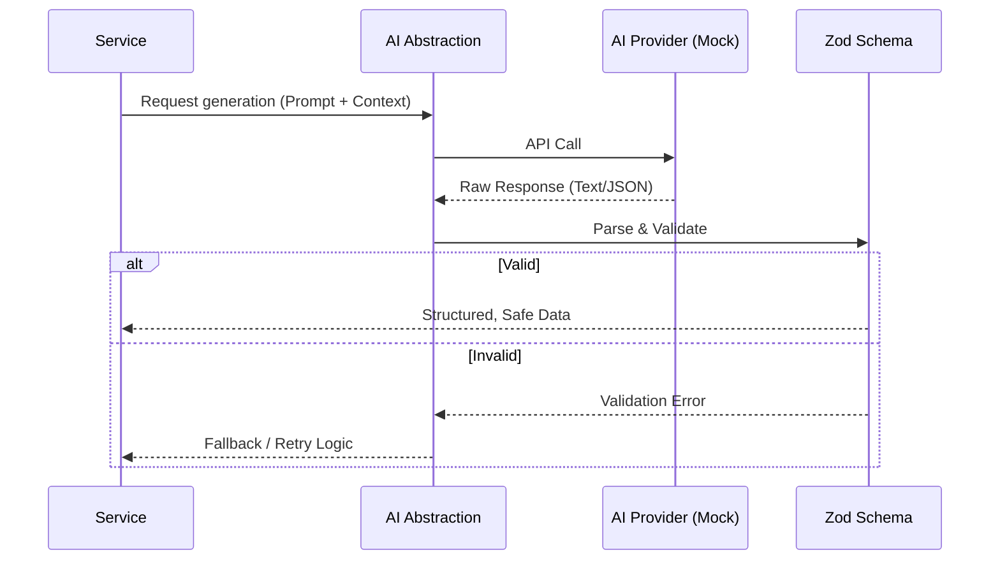

# AI Architecture

The Email Automation platform integrates AI capabilities (like content generation and workflow optimization) using a provider-agnostic approach.

## AI Provider Abstraction
- The system does not tightly couple with any single AI vendor (e.g., OpenAI, Anthropic).
- Instead, it defines an internal `AIProvider` interface.
- **Stage 1 Status**: We have implemented foundation classes and mock providers. These mocks return deterministic responses to facilitate frontend and workflow testing without incurring API costs.

## Validation Boundaries
- AI outputs are inherently unpredictable. To protect system integrity, all data returned by an AI provider is treated as **untrusted input**.
- The architecture enforces strict **Validation Boundaries** around AI responses.
- Before AI-generated content (e.g., JSON structures for a campaign workflow) is passed to the Service Layer, it must be parsed and validated against strict schemas (using Zod).

## Data Flow for AI Features

