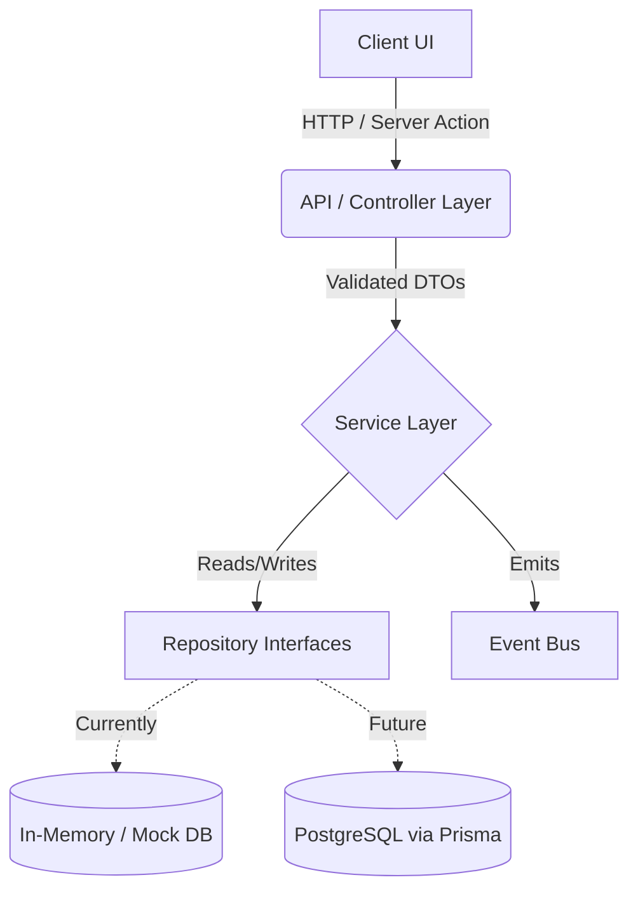

# Data Flow

The data flow within the Email Automation platform follows a strict unidirectional pattern to ensure separation of concerns and maintainable boundaries.

## Typical Request Lifecycle (Client -> API -> Service -> Foundation)

1. **Client (UI Component)**
   - The user interacts with a React component (e.g., clicking "Send Campaign").
   - The client invokes a Next.js Server Action or makes an HTTP request to an API Route.

2. **API / Controller Layer**
   - **Next.js Route Handler / Server Action**: Receives the request.
   - **Responsibility**: Validates incoming request parameters (e.g., using Zod), checks authentication and authorization (RBAC context), and formats the response.
   - **Rule**: This layer contains NO business logic. It delegates strictly to the Service layer.

3. **Service Layer (Domain Logic)**
   - Receives validated data from the API layer.
   - **Responsibility**: Executes the core business logic, orchestrates multiple operations, and emits domain events via the internal Event Bus.
   - **Rule**: Unaware of HTTP contexts or specific external databases.

4. **Foundation / Infrastructure Layer**
   - **Data Access**: The Service layer calls repository interfaces. Currently, these resolve to mock/in-memory implementations (Stage 1). Eventually, these will interface with Prisma ORM.
   - **External Services**: API clients for third-party providers (e.g., AI providers, Email SMTP).

## Data Flow Diagram

> [!NOTE]
> In this Stage 1 architecture, the mock databases and in-process event buses perfectly mirror the intended boundaries of the final production system, ensuring a smooth transition to real infrastructure later.
